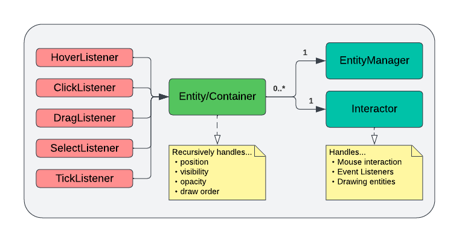
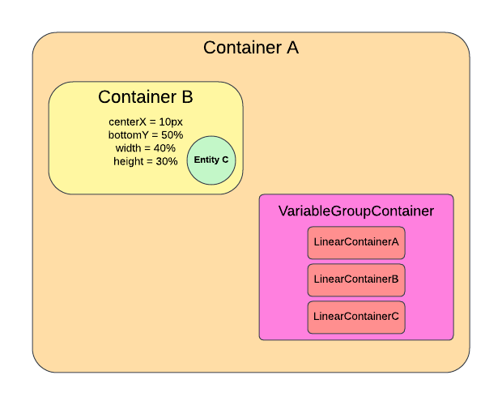

# Quickstart to Pathogen 4.0 Development
This guide aims to provide an overview of the Pathogen codebase from the lens of UI. Through a walkthrough of an example inserting a new interactable UI component on the screen, the hope is that tackling new UI features will feel much less overwhelming on this codebase.

## Coding guidelines
To preface any tutorials, I must emphasize that high code quality is required for code contribution! It is tough to maintain a codebase with over 10k lines of code, so we must remain vigilant to keep code as clean and readable as possible. Here are some general coding practices I try to follow.

### Code purposefully, and comment for "why" not "how".
Code in a simple, obvious style, using descriptive variable and function names to explain code. If you need to comment code to explain _how_ it works, then the better solution is probably to rewrite the code in a way that is more understandable. Instead, use commenting for the _why_ - to describe high-level behavior and explain its importance.

### Keep code short
Try to keep classes <200 LOC if possible, and functions short. The easiest way for code to spiral into an unmaintainable spaghetti mess is for "god" classes to emerge and suddenly take over the entire codebase. Trust me, it's happened so many times in the past and it's a nightmare to clean up.

### Follow good OOP practices
SOLID and single responsibility, DRY, composition over inheritance, etc.
Most likely, if it looks like complex relationships are needed, reach out to me first so we can sort things out.

### Follow programming conventions
In this case, follow *my* conventions :) The gist is just to keep code formatting consistent throughout the codebase.

## An Overview


Every UI component in Pathogen is an Entity. An Entity is some visual component with a position, width, and height defined by its parent Entity, and can have different event listeners attached to it.

Entities can contain child entities, which would most often reside inside the entity and be defined by the entity's position and dimensions.

By attaching event listeners (hover, click, drag, select, tick), entities can be made to easily interact with the mouse.

Containers are a subclass of entities with a single additional property: they are never visible, and so are most useful as ways to organize and position the children entities it contains.



Here's an illustration for how entities/containers work. Container A is the parent entity of Container B. Thus, Container B is defined relative to Container A. Entities must define four values - x, y, width, and height, relative to their parent. These can be specified in units of *pixels*, which are in absolute units, or *percentages*, which are relative to their parents.

For example, a width of 40% would mean that the width of the child is 40% of the parent's width. An x of 20% would be the x position at 20% of the horizontal span of the parent. A y of 2px would mean 2 pixels below the top of the parent.

In addition, for x and y, it's possible to specify either the top/left, center, or bottom/right for each value. For example, you may specify center x and top y. But, you cannot specify both center x and left x, for example.

On the bottom right, there's a special type of container called a VariableGroupContainer, which is dynamically sized based on children. It's out of the scope of this quickstart to go into depth on that class, but in general, instead of defining your dimensions by your parent, you also have the option to define them by your children.

## Positioning in the Entity class
Class Entity, located at entity_base/entity.py, is perhaps the most important class to fully understand.

PAUSE. You should read and attempt to understand it throughly before returning to this quickstart. The rest of this section refers to code in this class.

The first thing to notice is that the first parameter of the constructor is the parent entity. Every entity, except the root entity that spans the entire screen, must have a parent entity, through which relative position is defined.

In the class, there are a bunch of functions such as
```python
def defineTopLeft(self) -> float:
def defineCenterX(self) -> float:
...
def defineWidth(self) -> float:
def defineHeight(self) -> float:
```
You should override a total of four of those functions to properly define x, y, width, and height for the entity relative to the parent.

In the definition of those functions, it is expected that the RAW position values are returned. But because we want to define positions relatively, some helper functions are provided, listed near the end of the class.

```python
def _px(self, px) -> float:
def _py(self, py) -> float:
def _ax(self, pixels) -> float:
def _ay(self, pixels) -> float:
...
def _aheight(self, pixels) -> float:
```
You should read the comments for each of those functions. Essentially, they give you the position relative to the parent. `p` stands for percent, and `a` stands for absolute pixels. For example, to define the child's center x to be at 40% of the parent's horizontal span, write the following code in the child class:

```python
def defineWidth(self) -> float:
        return self._pwidth(0.4)
```

## Control flow in the Entity class
Pathogen's framework is written so that entities are recomputed purely based on events, and not on every tick. Whenever recomputePosition() is called, the entity calls all the position functions like `defineCenterX()` and updates the following state variables:
* `self.WIDTH`, `self.HEIGHT`
* `self.LEFT_X`, `self.CENTER_X`, `self.RIGHT_X`
* `self.TOP_Y`, `self.CENTER_Y`, `self.BOTTOM_Y`

In addition, there is a convience state variable `self.RECT`, which is defined to be set to `[self.LEFT_X, self.TOP_Y, self.WIDTH, self.HEIGHT]`.

These variables are otherwise read-only, and are all updated on `recomputeEntity()`. Note that, if you overrode defineLeftX() for example, it still updates `self.CENTER_X` and `self.RIGHT_X`.

You may use these state variables for things like checking for mouse collision and drawing the entity itself.

Your entity should call `recomputeEntity()` if it must change its position or dimensions for whatever reason. Note that when the parent entity gets resized, `recomputeEntity()` for this entity will be called automatically.

## Other must-override functions
If your want your entity to be visible, you must override `draw(screen, isActive: bool, isHovered: bool)`. isActive is mostly decaprecated but indicates whether the mouse is selecting the object, while isHovered indicates whether the mouse is hovering over the object.

The draw order for entities is recursive, with parents drawn before children. If there are multiple child entities for a parent and you want to specify a specific draw order between those children, you should pass in a DrawOrder enum to the constructor of the entity, which orders the entity by the enum value.

If you want any sort of mouse interaction with the entity, you should probably override the function:

```python
def isTouching(self, mouse: tuple) -> float
```
By default, it is defined to detect whether the mouse is inside `self.RECT`. If you want other behavior, you should override this yourself. The parameter `mouse` is simply an (x,y) tuple, but note that this is the raw mouse position in pixels.

Finally, call `setVisible()` and `setInvisible()` to, well, make the entity visible or invisible. While invisible, recomputation will be skipped. Once the entity is visible again, then recomputation will resume. You should not override those functions.

## A simple example
Let's write a simple example to add a rectangle in the center of the field area, and click the rectangle to toggle whether the rectangle is filled.

The RootContainer entity encompasses the entire screen. it has two children: FieldContainer and PanelContainer. They occupy the respective left and right subspaces of RootContainer. Each has further children. **The directory structure from /root_container reflects the hierarchical structure of the entities, and you should take care to maintain this status**

We want the parent of this rect entity to be the FieldContainer, so out of convention, we will be creating the RectContainer instance there. But first, let's create a RectContainer class inside the /field_container folder. It should look like this:

```python
from entity_base.entity import Entity
import pygame

class RectEntity(Entity):
    
    def __init__(self, parent: Entity):
        super().__init__(parent = parent)

    def defineWidth(self) -> float:
        return self._pwidth(0.4)
    
    def defineHeight(self) -> float:
        return self._pheight(0.2)
    
    def defineCenterX(self) -> float:
        return self._px(0.5)
    
    def defineCenterY(self) -> float:
        return self._py(0.5)

    def draw(self, screen, isActive, isHovering):
        pygame.draw.rect(screen, (0, 0, 0), self.RECT, 2)

```

Then, in the `field_container.py` file, add the following import:
```python
from root_container.field_container.rect_entity import RectEntity
```

Then, at the end of the FieldContainer constructor, create the RectEntity instance:
```python
RectEntity(self)
```
Note that self refers to FieldContainer, which is designated the parent of RectEntity.

And there we go! We now have a rectangle sitting squarely at the center of the screen. Play around with different values and different position function overrides to further explore how they work.

## Adding mouse interaction
We want to implement the feature where, when clicking the object, whether the rect is filled is toggled.

For now, we won't need to override `isTouching()`, because the default rect hitbox behavior is acceptable for us. Instead, what we first want to do is attach a `ClickListener` object to this entity, to be able to listen for `onLeftClick` events.

This involves importing the ClickLambda class:
```python
from entity_base.listeners.click_listener import ClickLambda
```

Then, let's modify the super() call to attach this click listener:
```python
super().__init__(parent = parent,
                         click = ClickLambda(self, FonLeftClick = [SOME FUNCTION]
```

Here, `FonLeftClick` stores the callback for when the left click is pressed. We need to create a callback function. Note that the callback expects to take in a tuple parameter which is position of the mouse.

In the constructor of RectEntity, I'll add an instance variable, `self.isFilled` and set it to False for default. The callback should simply invert this boolean. Create a method that does this, and assign the method to the callback parameter.

Then, we can use `self.isFilled` to determine whether to fill the rectangle when drawing it.

Here's the final code:
```python
from entity_base.entity import Entity
from entity_base.listeners.click_listener import ClickLambda
import pygame

class RectEntity(Entity):
    
    def __init__(self, parent: Entity):

        self.isFilled = False

        super().__init__(parent = parent,
                         click = ClickLambda(self, FonLeftClick = self.onClick))
        
    def onClick(self, mouse: tuple):
        self.isFilled = not self.isFilled

    def defineWidth(self) -> float:
        return self._pwidth(0.4)
    
    def defineHeight(self) -> float:
        return self._pheight(0.2)
    
    def defineCenterX(self) -> float:
        return self._px(0.5)
    
    def defineCenterY(self) -> float:
        return self._py(0.5)

    def draw(self, screen, isActive, isHovering):
        pygame.draw.rect(screen, (0, 0, 0), self.RECT, 0 if self.isFilled else 2)
```

And this should work! Try running the program and clicking the rectangle.

## Further notes
You should have a very basic understanding on how this framework works now! There's a few additional things to consider:
* look through utility files `math_functions.py` and `pygame_functions.py` for helpful functions that could save painful (redundant) work
* If you want a callback for an entity to be called every tick of the main loop, look into the `TickListener` and `TickLambda` classes.
* The observer pattern is used for when an entity needs to send update notifications to other entities, i.e. when an entity is dependent on another entity's state. Entities that observe other entities must extend `Observer`, and entities that are observerable and send pings must extend `Observable`. The `subscribe()` function is used to subscribe to another entity to recieve updates from them.
