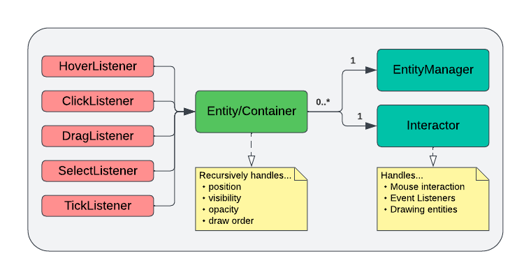
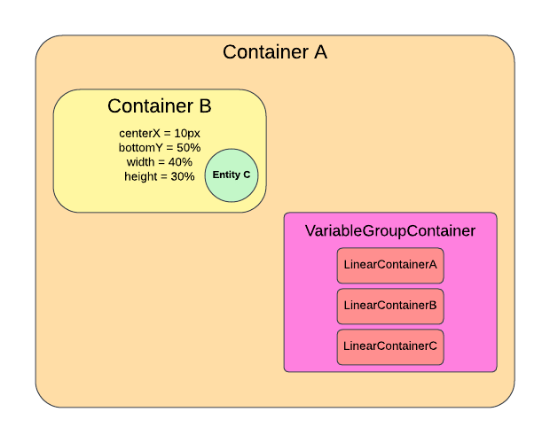

# Quickstart to Pathogen 4.0
This guide aims to provide an overview of the Pathogen codebase from the lens of UI. Through a walkthrough of an example inserting a new interactable UI component on the screen, the hope is that tackling new UI features will feel much less overwhelming on this codebase.

## An Overview

Every UI component in Pathogen is an Entity. An Entity is some visual component with a position, width, and height defined by its parent Entity, and can have different event listeners attached to it.

Entities can contain child entities, which would most often reside inside the entity and be defined by the entity's position and dimensions.

By attaching event listeners (hover, click, drag, select, tick), entities can be made to easily interact with the mouse.

Containers are a subclass of entities with a single additional property: they are never visible, and so are most useful as ways to organize and position the children entities it contains.


Here's an illustration for how entities/containers work. Container A is the parent entity of Container B. Thus, Container B is defined relative to Container A. Entities must define four values - x, y, width, and height, relative to their parent. These can be specified in units of *pixels*, which are in absolute units, or *percentages*, which are relative to their parents.

For example, a width of 40% would mean that the width of the child is 40% of the parent's width. An x of 20% would be the x position at 20% of the horizontal span of the parent. A y of 2px would mean 2 pixels below the top of the parent.

In addition, for x and y, it's possible to specify either the top/left, center, or bottom/right for each value. For example, you may specify center x and top y. But, you cannot specify both center x and left x, for example.

On the bottom right, there's a special type of container called a VariableGroupContainer, which is dynamically sized based on children. It's out of the scope of this quickstart to go into depth on that class, but in general, instead of defining your dimensions by your parent, you also have the option to define them by your children.

## Positioning in the Entity class
Class Entity, located at entity_base/entity.py, is perhaps the most important class to fully understand.

PAUSE. You should read and attempt to understand it throughly before returning to this quickstart. The rest of this section refers to code in this class.

The first thing to notice is that the first parameter of the constructor is the parent entity. Every entity, except the root entity that spans the entire screen, must have a parent entity, through which relative position is defined.

In the class, there are a bunch of functions such as
```python
def defineTopLeft(self) -> float
def defineCenterX(self) -> float
...
def defineWidth(self) -> float
def defineHeight(self) -> float
```
You should override a total of four of those functions to properly define x, y, width, and height for the entity relative to the parent.

In the definition of those functions, it is expected that the RAW position values are returned. But because we want to define positions relatively, some helper functions are provided, listed near the end of the class.

```python
def _px(self, px) -> float
def _py(self, py) -> float
def _ax(self, pixels) -> float
def _ay(self, pixels) -> float
...
_aheight(self, pixels) -> float
```
You should read the comments for each of those functions. Essentially, they give you the position relative to the parent. For example, to define the child's center x to be at 40% of the parent's horizontal span, write the following code in the child class:

```python
def defineWidth(self) -> float:
        return self._pwidth(0.4)
```

## Control flow in the Entity class

